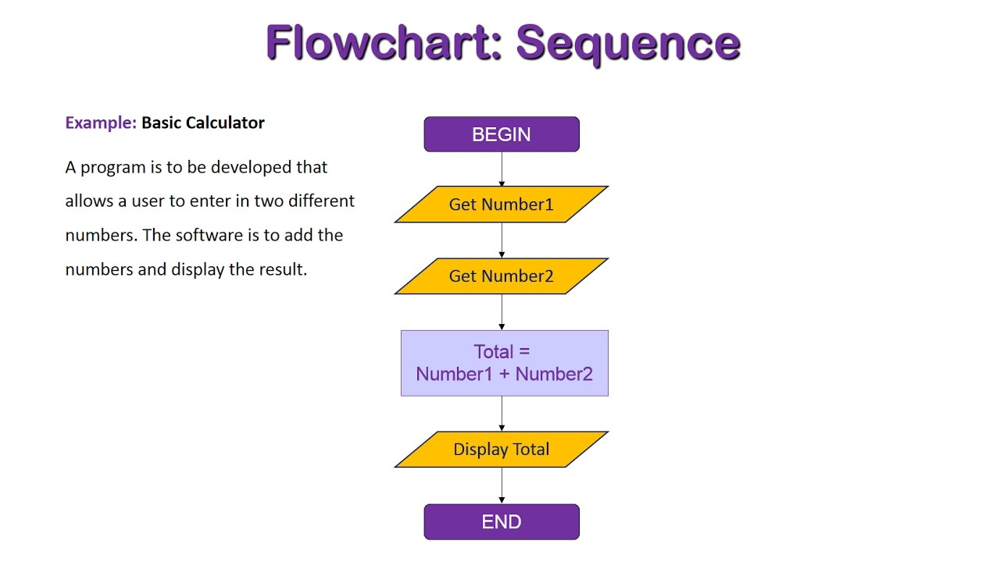
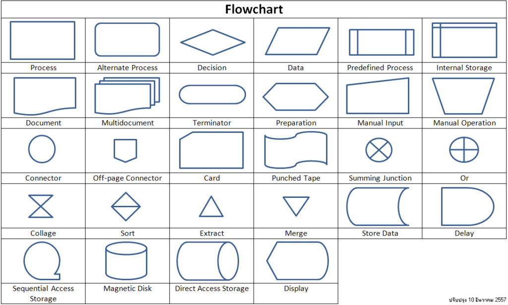
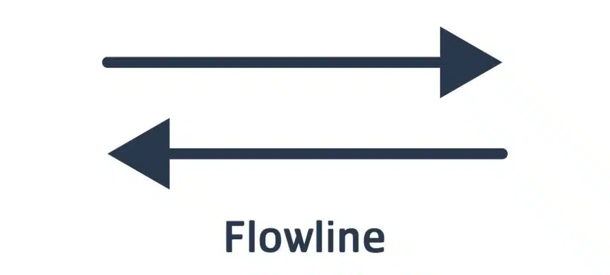
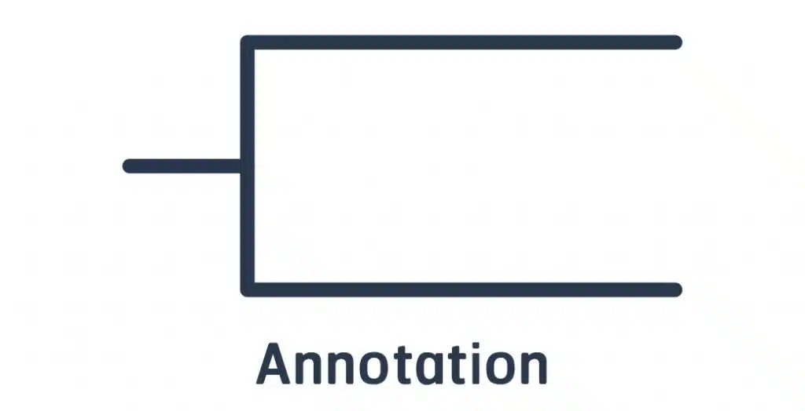
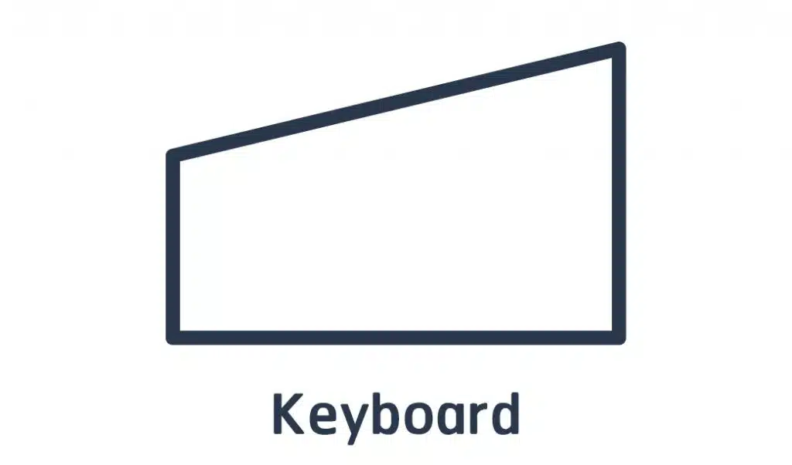
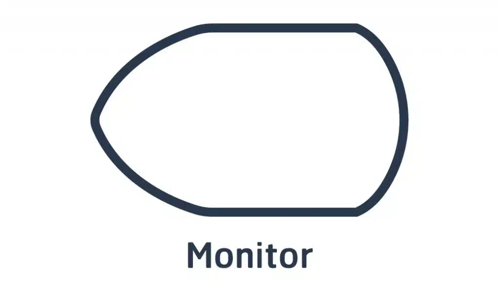

0 - ความสำคัญของ Flowchart
    อืมมม ถ้าให้พูดว่ามันสำคัญแค่ไหนผมก็คงต้องเรียนตามตรงว่ามันค่องข้างที่จะสำคัญมากในส่วนหนึ่ง อยากให้คุณมองการเขียนโปรแกรมเป็นการเดินทาง การมี flowchart จะช่วยให้คุณมองภาพรวมได้ง่ายขึ้นก็เหมือน คุณจะมีแผนที่ในการเดินทางมันเลยทำให้เราเดินทางได้สะดวกขึ้น ถ้าถามว่าการทำงานโดยไม่มี Flowchart หรือการพัฒนาแบบ MVP เลยจะไม่ไวกว่าหรอ? สำหรับผมแล้วใช่ครับ มันไวกว่า แต่มันก็ทำให้เราทำเพิ่มไปเรื่อยๆ แล้วกว่าจะรู้ตัวอีกที flowchart ระบบเล็กๆที่เราต้องการก็ใหญ่เกิน และบางครั้งเราก็อาจสับสนมันได้ เพราะงั้นการวางแผนในเรื่อง Flowchart ก่อนก็ถือเป็นเรื่องที่ดีครับ และในขั้นต่อๆไปเราจะขอเรียก Flowchart เป็น ผังงาน Flowchart นะครับ

01 - รูปแบบของผังงาน Flowchart
    ในส่วนของรูปแบบการทำงานของผังงาน Flowchart นะครับ เราจะแบ่งออกเป็น 3 ส่วนหลักๆ ได้แก่ 
    -1.การทำงานแบบตามลำดับนะครับ (Sequence Flowchart)
    
    ขออนุญาตนำภาพมาจาก [Christopher Kalodikis](https://www.youtube.com/watch?v=WnLWqdSbAo0) มาให้ทุกท่านดู
    จากภาพทุกคนจะเห็นได้ว่าการทำงานของมันนั้นจะเริ่มจากบนลงล่าง ซึ่งเป็นแนวตรงลงมา เป็นการทำงานแบบตามลำดับ (Sequence Flowchart)โดยมีโครงสร้างในการเขียนคำสั่งเป็นบรรทัด และก็ทำงานตามคำสั่งทีละบรรทัดจากบรรทัดแรก(บนสุด)ที่เป็นการเริ่มต้นคำสั่งลงไปจนถึงบรรทัดล่างสุดเป็นการสิ้นสุดคำสั่ง
    -2.การทำงานแบบเลือกกระทำตามเงื่อนไข (Selection Flowchart)
    
    ขออนุญาตนำภาพมาจาก [taylor.2317](https://stackoverflow.com/questions/71020681/standard-way-of-representing-selection-in-flowcharts) มาให้ทุกท่านดู
    ซึ่งทุกท่านก็จะเห็นถึงว่า มีการเพิ่มเงื่อนไขขึ้นมา โดยเราจะเรียนสิ่งเหล่านี้ว่า การตัดสินใจหรือการเลือกทำตามเงื่อนไข โดยการวิเคราะห์จากข้อมูลจะมีเหตุการณ์ให้ดำเนินการต่อไป 2 กระบวนการ คือ ถ้าหากเงื่อนไขเป็นจริงจะดำเนินการตามกระบวนการหนึ่ง และหากเงื่อนไขเป็นเท็จจะดำเนินการอีกกระบวนการหนึ่ง ถ้าให้ผมตีความให้เข้าใจง่ายขึ้นผมให้คุณคิดแบบนี้ว่า ถ้าตอนนี้เราอยู่ที่ชั้น 3 (Start) และต้องการลงไปที่ชั้น 1 ถ้าเราเลือกลงลิฟท์ Yes (สบาย) แต่ถ้าเราเลือกลงบรรได No (เหนื่อยจัง) นี่ก็จะแสดงผลลัพธ์ที่ไม่เหมือนกัน
    -3.การทำซ้ำ (Iteration Flowchart)
    
    ขออนุญาตนำภาพมาจาก [By Kat Boogaard, Contributing Writer](https://miro.com/blog/flowchart-loops-guide/) มาให้ทุกท่านดู
    เป็นการทำงานที่ย้อนกลับไปทำขั้นตอนเดิมซ้ำๆ จนกว่าเงื่อนไขที่กำหนดไว้จะเป็นเท็จ (หรือเป็นจริง แล้วแต่ชนิดของ Loop) หัวใจสำคัญ: ต้องมี "ทางออก" จาก Loop เสมอ ไม่เช่นนั้นจะเกิดสิ่งที่เรียกว่า Infinite Loop (โปรแกรมค้างหรือทำงานไม่สิ้นสุด) ตัวอย่าง: การกรอกรหัสผ่าน (Password) ถ้ากรอกผิด ระบบจะวนกลับไปให้กรอกใหม่จนกว่าจะถูก

02 - หลักการเขียนผังงาน Flowchart (Flowchart diagram)
    Flowchart diagram มีโครงสร้างและวิธีการเขียนที่ค่อนข้างมาตรฐานในตัวอยู่แล้ว เนื่องจากมีการกำหนดสัญลักษณ์ต่าง ๆ ตามมาตรฐานสากลที่ใช้กันทั่วโลก ซึ่งการเขียน Flowchart ให้สามารถทำความเข้าใจได้ง่ายนั้น ไม่เพียงแค่ต้องใช้สัญลักษณ์ถูกต้องเพียงเท่านั้น แต่จะต้องมีหลักการต่าง ๆ ร่วมด้วย โดยหลักการหรือวิธีการเขียนผังงานที่ดีมีดังนี้        
        •  การเขียน Flowchart ควรใช้สัญลักษณ์มาตรฐานตามหลักสากลที่กำหนดไว้โดย The American National Standard Institute, ANSI            
        •  เขียน Flowchart โดยใช้ลูกศรแสดงทิศทางการไหลของข้อมูลตามลำดับจากบนลงล่างหรือจากซ้ายไปขวา            
        •  การเขียน Flowchart จะต้องใช้คำอธิบายในแต่ละขั้นตอนให้มีความกระชับและเข้าใจง่ายเพื่อเขียนลงในสัญลักษณ์ต่าง ๆ             
        •  การเขียนผังงานนั้น ในทุก ๆ สัญลักษณ์ Flowchart จะต้องมีลูกศรแสดงทิศทางเข้า-ออกของข้อมูลเพื่อความชัดเจน            
        •  ในการเขียน Flowchart ไม่ควรโยงเส้นเชื่อมสัญลักษณ์ของผังงานที่อยู่ไกลกัน แต่ควรใช้สัญลักษณ์จุดเชื่อมต่อเพื่อสื่อสารแทน เนื่องจากการโยงเส้นเชื่อมกันของสัญลักษณ์ Flowchart ที่อยู่ไกลกันนั้นอาจทำให้สับสนในขั้นตอนการทำงานได้        
        •  การเขียนผังงานหรือ Flowchart ควรมีการทดสอบความถูกต้องของอัลกอริทึมก่อนที่จะนำไปปฏิบัติงานหรือเขียนโปรแกรม
    
1 - พื้นฐานสัญลักษณ์ (Standard Symbols)
    
     ขออนุญาตนำภาพจาก [codegenius](https://codegeniusacademy.com/flowchart/) มาให้ทุกท่านดู
    นี้คือภาพตัวอย่างของ สัญลักษณ์ทั้งหมดของ Flowchart 

1.1 - สัญลักษณ์แสดงขั้นตอนการทำงาน
    1.1.1 - Start/Stop สัญลักษณ์กำหนดจุดเริ่มต้นของการทำงาน และแสดงจุดสิ้นสุดของการทำงาน
    
    1.1.2 - Process สัญลักษณ์ Flowchart แสดงรายละเอียดของการทำงาน
    
    1.1.3 - Decision สัญลักษณ์แสดงรายละเอียดการเปรียบเทียบในเงื่อนไขการทำงานขขั้นตอนต่าง ๆ ใช้ใช้เมื่อจะต้องตัดสินใจว่า ใช่หรือไม่ใช จริงหรือเท็จ
    
    1.1.4 - Flowline สัญลักษณ์ที่มีลักษณะคล้ายลูกศรนี้แสดงทิศทางความสัมพันธ์ของการทำงานในระบบงานหรือลำดับงานในการเขียนผังงานโครงสร้าง (Structured Flowchart)
    
    1.1.5 - IN-Page Connector สัญลักษณ์ของผังงานที่แสดงถึงการกำหนดจุดอ้างอิงในการเชื่อมต่อ  ในหน้ากระดาษ เดียวกันของการเขียน Flowchart
    
    1.1.6 - Between-Page สัญลักษณ์โฟลวชาร์ตแสดงการกำหนดจุดอ้างอิงในการเชื่อมต่อ ระหว่าง หน้ากระดาษของการเขียนผังงาน
    
    1.1.7 - Annotation สัญลักษณ์ Flowchart ที่แสดงการระบุหมายเหตุเพื่อใช้อธิบายรายละเอียดเพิ่มเติมของการดำเนินงาน
    
    1.1.8 - SubProgram สัญลักษณ์แสดงคำสั่งการทำงานย่อยที่มีขอบเขตการดำเนินงานที่ชัดเจน โดยสามารถรับค่าข้อมูลที่ถูกส่งเข้าไปเพื่อเป็นข้อมูลประกอบการทำงาน  และ/หรือ สามารถส่งข้อมูลผลลัพธ์กลับมาเข้าสู่ระบบการดำเนินงานหลักเพื่อรับคำสั่งดำเนินการต่อไปได้ 

1.2 - สัญลักษณ์ Flowchart ที่ใช้รับค่าข้อมูล
    1.2.1 - Read สัญลักษณ์ Flowchart แสดงถึงการรับค่าข้อมูลหรืออ่านข้อมูลเข้ามาโดยไม่ระบุอุปกรณ์ รับข้อมูล (Input Device)  
    
    1.2.2 - Keyboard สัญลักษณ์ Flowchart แสดงถึงการรับค่าข้อมูลหรืออ่านข้อมูลเข้ามาจากคีย์บอร์ด
    

1.3 - สัญลักษณ์ Flowchart ที่ใช้แสดงผลของข้อมูล
    1.3.1 - Write สัญลักษณ์ Flowchart ที่ใช้แสดงรายละเอียดข้อมูลหรือผลลัพธ์ของการประมวลผล โดยไม่ระบุอุปกรณ์การแสดงผล (Output Device)  
    
    1.3.2 - Monitor แสดงรายละเอียดข้อมูลหรือผลลัพธ์ของการประมวลผลไปที่จอภาพ(Monitor)
    
    1.3.3 - Printer แสดงรายละเอียดข้อมูลหรือผลลัพธ์ของการประมวลผลไปที่เครื่องพิมพ์(Printer)
    
    
ขออนุญาตนำภาพสัญลักษณ์จาก [codegenius](https://codegeniusacademy.com/flowchart/) มาแสดงให้ดู

    

